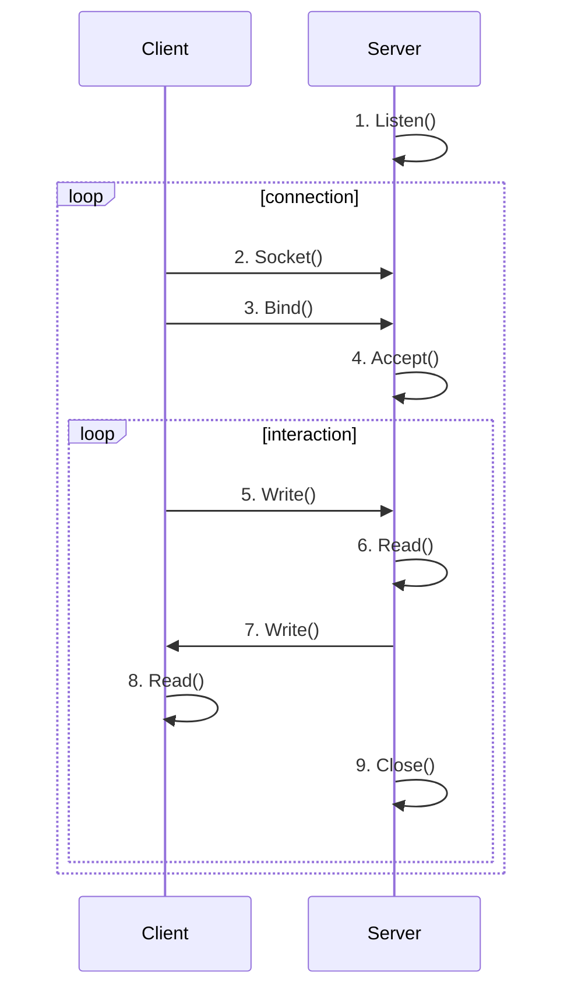
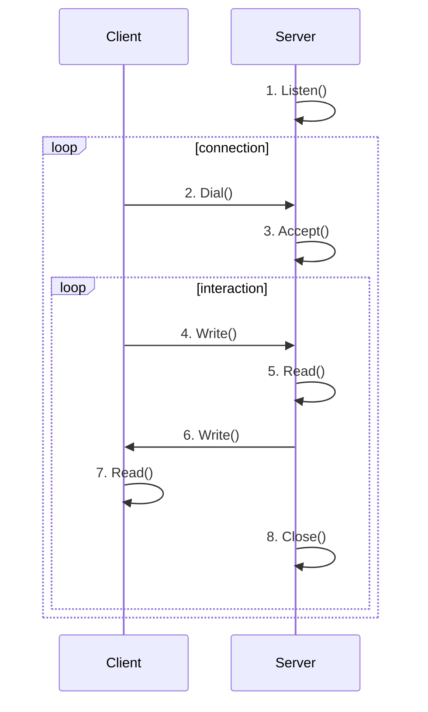

# Go语言Web Server实现

### Go的第三方Web库

在Go语言当中有很多知名的Web服务，例如[gin](https://github.com/gin-gonic/gin)和[beego](https://github.com/beego/beego)，在它们的描述中都提到了`high-performance`，我们的文章会从最原始的socket来实现一个简单的web服务器。实现的服务与gin、beego做一次性能对比，对比工具使用ab（我们只做了一个不严肃的性能测试，我们只能去做个人能做的事情）。

### Go语言TCP服务的原理

#### 一般语言实现

c 语言去实现一个简单的http server并不难，但如果要保持高性能，例如nginx自己做了所有的一切，并不是很容易。你需要去管理连接，并采用合理的io模型和策略。下面是一个最基本的流程。



服务器端的工作主要是listen()和accept()连接，然后进入到交互过程，最终close()连接。

#### go语言实现



服务器端和c语言差不多，客户端省掉了一个bind()过程，合并成Dial()，翻译成中文为拨号。

### 实现代码

#### gin 和 beego 是怎样实现的

我们先看看gin 和 beego都做了什么 它们都调用了net库下的net/http/server下的Serve()方法实现HTTP服务器，因此如果我们的代码与该方法一致或者做了精简，那么理论上性能是一致的。并没有做更多的额外的优化和处理。


```go
// Serve accepts incoming connections on the Listener l, creating a
// new service goroutine for each. The service goroutines read requests and
// then call srv.Handler to reply to them.
//
// HTTP/2 support is only enabled if the Listener returns *tls.Conn
// connections and they were configured with "h2" in the TLS
// Config.NextProtos.
//
// Serve always returns a non-nil error and closes l.
// After Shutdown or Close, the returned error is ErrServerClosed.
func (srv *Server) Serve(l net.Listener) error {
	if fn := testHookServerServe; fn != nil {
		fn(srv, l) // call hook with unwrapped listener
	}

	origListener := l
	l = &onceCloseListener{Listener: l}
	defer l.Close()

	if err := srv.setupHTTP2_Serve(); err != nil {
		return err
	}

	if !srv.trackListener(&l, true) {
		return ErrServerClosed
	}
	defer srv.trackListener(&l, false)

	baseCtx := context.Background()
	if srv.BaseContext != nil {
		baseCtx = srv.BaseContext(origListener)
		if baseCtx == nil {
			panic("BaseContext returned a nil context")
		}
	}

	var tempDelay time.Duration // how long to sleep on accept failure

	ctx := context.WithValue(baseCtx, ServerContextKey, srv)
	for {
		rw, err := l.Accept()
		if err != nil {
			select {
			case <-srv.getDoneChan():
				return ErrServerClosed
			default:
			}
			if ne, ok := err.(net.Error); ok && ne.Temporary() {
				if tempDelay == 0 {
					tempDelay = 5 * time.Millisecond
				} else {
					tempDelay *= 2
				}
				if max := 1 * time.Second; tempDelay > max {
					tempDelay = max
				}
				srv.logf("http: Accept error: %v; retrying in %v", err, tempDelay)
				time.Sleep(tempDelay)
				continue
			}
			return err
		}
		connCtx := ctx
		if cc := srv.ConnContext; cc != nil {
			connCtx = cc(connCtx, rw)
			if connCtx == nil {
				panic("ConnContext returned nil")
			}
		}
		tempDelay = 0
		c := srv.newConn(rw)
		c.setState(c.rwc, StateNew, runHooks) // before Serve can return
		go c.serve(connCtx)
	}
}
```


#### 实现一个 http 服务器

#### client

```go
package main

import (
	"fmt"
	"net"
)

func main() {
	conn, err := net.Dial("tcp", ":8100")
	if err != nil {
		panic(err)
	}
	_, err = conn.Write([]byte("GET /profile HTTP/1.1\r\nHost: 127.0.0.1\r\n\r\n"))
	if err != nil {
		panic(err)
	}
	buf := make([]byte, 1024)
	rn, err := conn.Read(buf)
	if err != nil {
		return
	}
	fmt.Println(string(buf[:rn]))
}
```

#### server

```go
package main

import (
	"bufio"
	"fmt"
	"net"
	"os"
	"strings"
)

type handler func(conn net.Conn)

var handlers = make(map[string]handler)

func main() {
	get("/profile", func(conn net.Conn) {
		data, err := os.ReadFile("./html/profile.html")
		if err != nil {
			return
		}
		resp(conn, data)
	})
	get("/home", func(conn net.Conn) {
		data, err := os.ReadFile("./html/home.html")
		if err != nil {
			return
		}
		resp(conn, data)
	})
	listen, err := net.Listen("tcp", ":8100")
	if err != nil {
		panic(err)
	}
	for {
		conn, err := listen.Accept()
		if err != nil {
			panic(err)
		}
		go serve(conn)
	}
}

func serve(conn net.Conn) {
	for {
		message, err := bufio.NewReader(conn).ReadString('\n')
		if err != nil {
			break
		}
	
		message = strings.TrimSpace(message)
		if strings.HasPrefix(message, "GET ") {
			sp := strings.Split(message, " ")
			if handler, ok := handlers[sp[1]]; ok {
				handler(conn)
				conn.Close()
			}
		}
	
	}
}

func get(uri string, handler handler) {
	handlers[uri] = handler
}

func resp(conn net.Conn, body []byte) {
	content := fmt.Sprintf("HTTP/1.1 200 OK\r\n\r\n%s", string(body))
	conn.Write([]byte(content))
}

```

server端与net/http/server下的Serve()方法几乎相同，只是做了更大的精简，核心是for + Accept() + goroutine。

go语言的_goroutine_本身就有极高的性能，因此替代了c语言自己去实现connections pool的麻烦，简单调用就可以实现很高的性能。

### 性能测试

使用ab做一个简单的性能测试，不是很严谨，但足够说明问题。我们看一个最终结果的对比图，没有本质上的差别大概都在每秒3万次左右。（并发20，总请求是10000次）

|                     | server   | gin server | beego server |
| ------------------- | -------- | ---------- | ------------ |
| Requests per second | 30682.19 | 33626.22   | 32875.27     |

#### 测试在实现的 web server

```shell
langwan@Langwan-Mini meterun % ab -n 10000 -c 20 http://127.0.0.1:8100/profile
This is ApacheBench, Version 2.3 <$Revision: 1879490 $>
Copyright 1996 Adam Twiss, Zeus Technology Ltd, http://www.zeustech.net/
Licensed to The Apache Software Foundation, http://www.apache.org/

Benchmarking 127.0.0.1 (be patient)
Completed 1000 requests
Completed 2000 requests
Completed 3000 requests
Completed 4000 requests
Completed 5000 requests
Completed 6000 requests
Completed 7000 requests
Completed 8000 requests
Completed 9000 requests
Completed 10000 requests
Finished 10000 requests


Server Software:
Server Hostname:        127.0.0.1
Server Port:            8100

Document Path:          /profile
Document Length:        110 bytes

Concurrency Level:      20
Time taken for tests:   0.326 seconds
Complete requests:      10000
Failed requests:        0
Total transferred:      2950000 bytes
HTML transferred:       1100000 bytes
Requests per second:    30682.19 [#/sec] (mean)
Time per request:       0.652 [ms] (mean)
Time per request:       0.033 [ms] (mean, across all concurrent requests)
Transfer rate:          8839.11 [Kbytes/sec] received

Connection Times (ms)
              min  mean[+/-sd] median   max
Connect:        0    0   0.1      0       2
Processing:     0    0   0.3      0       9
Waiting:        0    0   0.3      0       9
Total:          0    1   0.4      1       9

Percentage of the requests served within a certain time (ms)
  50%      1
  66%      1
  75%      1
  80%      1
  90%      1
  95%      1
  98%      1
  99%      2
 100%      9 (longest request)
```

#### 测试 gin web server

```shell
langwan@Langwan-Mini meterun % ab -n 10000 -c 20 http://127.0.0.1:8100/profile
This is ApacheBench, Version 2.3 <$Revision: 1879490 $>
Copyright 1996 Adam Twiss, Zeus Technology Ltd, http://www.zeustech.net/
Licensed to The Apache Software Foundation, http://www.apache.org/

Benchmarking 127.0.0.1 (be patient)
Completed 1000 requests
Completed 2000 requests
Completed 3000 requests
Completed 4000 requests
Completed 5000 requests
Completed 6000 requests
Completed 7000 requests
Completed 8000 requests
Completed 9000 requests
Completed 10000 requests
Finished 10000 requests


Server Software:
Server Hostname:        127.0.0.1
Server Port:            8100

Document Path:          /profile
Document Length:        110 bytes

Concurrency Level:      20
Time taken for tests:   0.297 seconds
Complete requests:      10000
Failed requests:        0
Total transferred:      2950000 bytes
HTML transferred:       1100000 bytes
Requests per second:    33626.22 [#/sec] (mean)
Time per request:       0.595 [ms] (mean)
Time per request:       0.030 [ms] (mean, across all concurrent requests)
Transfer rate:          9687.24 [Kbytes/sec] received

Connection Times (ms)
              min  mean[+/-sd] median   max
Connect:        0    0   0.1      0       1
Processing:     0    0   0.2      0       3
Waiting:        0    0   0.2      0       3
Total:          0    1   0.2      1       3

Percentage of the requests served within a certain time (ms)
  50%      1
  66%      1
  75%      1
  80%      1
  90%      1
  95%      1
  98%      1
  99%      1
 100%      3 (longest request)
```

#### 测试 beego web server

```shell
langwan@Langwan-Mini meterun % ab -n 10000 -c 20 http://127.0.0.1:8100/profile
This is ApacheBench, Version 2.3 <$Revision: 1879490 $>
Copyright 1996 Adam Twiss, Zeus Technology Ltd, http://www.zeustech.net/
Licensed to The Apache Software Foundation, http://www.apache.org/

Benchmarking 127.0.0.1 (be patient)
Completed 1000 requests
Completed 2000 requests
Completed 3000 requests
Completed 4000 requests
Completed 5000 requests
Completed 6000 requests
Completed 7000 requests
Completed 8000 requests
Completed 9000 requests
Completed 10000 requests
Finished 10000 requests


Server Software:
Server Hostname:        127.0.0.1
Server Port:            8100

Document Path:          /profile
Document Length:        110 bytes

Concurrency Level:      20
Time taken for tests:   0.304 seconds
Complete requests:      10000
Failed requests:        0
Total transferred:      2270000 bytes
HTML transferred:       1100000 bytes
Requests per second:    32875.27 [#/sec] (mean)
Time per request:       0.608 [ms] (mean)
Time per request:       0.030 [ms] (mean, across all concurrent requests)
Transfer rate:          7287.78 [Kbytes/sec] received

Connection Times (ms)
              min  mean[+/-sd] median   max
Connect:        0    0   0.1      0       1
Processing:     0    0   0.2      0       7
Waiting:        0    0   0.2      0       7
Total:          0    1   0.3      1       8

Percentage of the requests served within a certain time (ms)
  50%      1
  66%      1
  75%      1
  80%      1
  90%      1
  95%      1
  98%      1
  99%      1
 100%      8 (longest request)
```

### 配套代码和视频

代码地址 [https://github.com/langwan/chihuo/blob/main/go%E8%AF%AD%E8%A8%80/Go%E8%AF%AD%E8%A8%80Web%20Server%E5%AE%9E%E7%8E%B0](https://github.com/langwan/chihuo/blob/main/go%E8%AF%AD%E8%A8%80/Go%E8%AF%AD%E8%A8%80Web%20Server%E5%AE%9E%E7%8E%B0)



