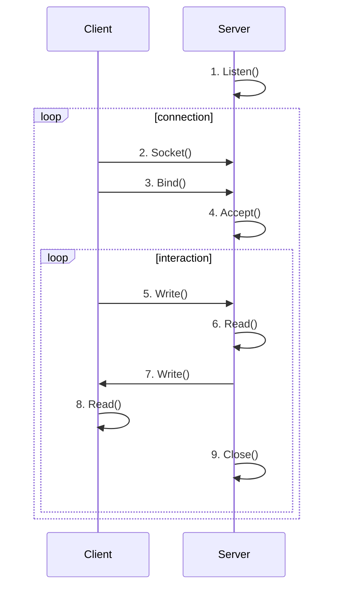
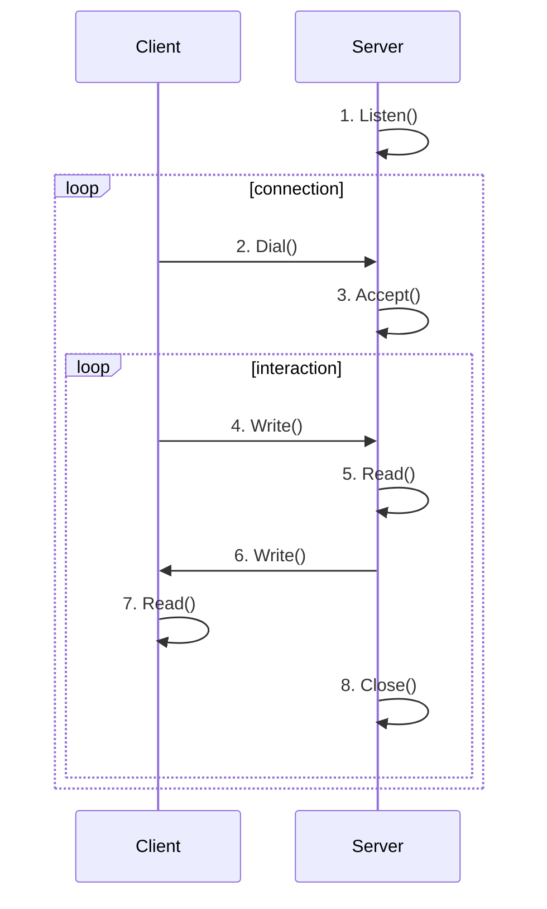

# Go语言Web Server实现

### Go的第三方Web库

在Go语言当中有很多知名的Web服务，例如[gin](https://github.com/gin-gonic/gin)和[beego](https://github.com/beego/beego)，在它们的描述中都提到了`high-performance`，我们的文章会从最原始的socket来实现一个简单的web服务器。

### Go语言TCP服务的原理

#### 一般语言实现



#### go语言实现



### 实现代码

#### gin和beego的代码片段


```go
// Serve accepts incoming connections on the Listener l, creating a
// new service goroutine for each. The service goroutines read requests and
// then call srv.Handler to reply to them.
//
// HTTP/2 support is only enabled if the Listener returns *tls.Conn
// connections and they were configured with "h2" in the TLS
// Config.NextProtos.
//
// Serve always returns a non-nil error and closes l.
// After Shutdown or Close, the returned error is ErrServerClosed.
func (srv *Server) Serve(l net.Listener) error {
	if fn := testHookServerServe; fn != nil {
		fn(srv, l) // call hook with unwrapped listener
	}

	origListener := l
	l = &onceCloseListener{Listener: l}
	defer l.Close()

	if err := srv.setupHTTP2_Serve(); err != nil {
		return err
	}

	if !srv.trackListener(&l, true) {
		return ErrServerClosed
	}
	defer srv.trackListener(&l, false)

	baseCtx := context.Background()
	if srv.BaseContext != nil {
		baseCtx = srv.BaseContext(origListener)
		if baseCtx == nil {
			panic("BaseContext returned a nil context")
		}
	}

	var tempDelay time.Duration // how long to sleep on accept failure

	ctx := context.WithValue(baseCtx, ServerContextKey, srv)
	for {
		rw, err := l.Accept()
		if err != nil {
			select {
			case <-srv.getDoneChan():
				return ErrServerClosed
			default:
			}
			if ne, ok := err.(net.Error); ok && ne.Temporary() {
				if tempDelay == 0 {
					tempDelay = 5 * time.Millisecond
				} else {
					tempDelay *= 2
				}
				if max := 1 * time.Second; tempDelay > max {
					tempDelay = max
				}
				srv.logf("http: Accept error: %v; retrying in %v", err, tempDelay)
				time.Sleep(tempDelay)
				continue
			}
			return err
		}
		connCtx := ctx
		if cc := srv.ConnContext; cc != nil {
			connCtx = cc(connCtx, rw)
			if connCtx == nil {
				panic("ConnContext returned nil")
			}
		}
		tempDelay = 0
		c := srv.newConn(rw)
		c.setState(c.rwc, StateNew, runHooks) // before Serve can return
		go c.serve(connCtx)
	}
}
```

使用go来实现的最简代码

#### client

```go
package main

import (
	"fmt"
	"net"
)

func main() {
	conn, err := net.Dial("tcp", ":8100")
	if err != nil {
		panic(err)
	}
	_, err = conn.Write([]byte("GET /profile HTTP/1.1\r\nHost: 127.0.0.1\r\n\r\n"))
	if err != nil {
		panic(err)
	}
	buf := make([]byte, 1024)
	rn, err := conn.Read(buf)
	if err != nil {
		return
	}
	fmt.Println(string(buf[:rn]))
}
```
